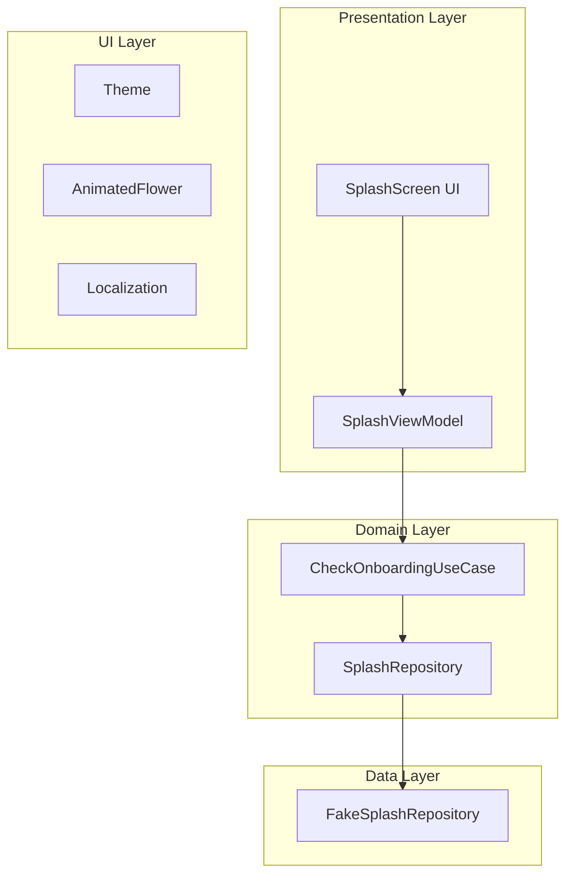

# VBANurseryApp Splash Screen Architecture

## Clean Architecture Implementation



## Package Structure

```
shared/
├── src/
│   ├── commonMain/
│   │   ├── kotlin/org/example/project/
│   │   │   ├── domain/
│   │   │   │   ├── SplashRepository.kt
│   │   │   │   ├── UseCase.kt
│   │   │   │   └── CheckOnboardingUseCase.kt
│   │   │   ├── data/
│   │   │   │   └── FakeSplashRepository.kt
│   │   │   ├── presentation/
│   │   │   │   ├── SplashUiState.kt
│   │   │   │   └── SplashViewModel.kt
│   │   │   └── Platform.kt
│   │   └── kotlin/
│   └── ...
│
composeApp/
├── src/
│   ├── commonMain/
│   │   ├── kotlin/org/example/project/
│   │   │   ├── ui/
│   │   │   │   ├── theme/
│   │   │   │   │   ├── Color.kt
│   │   │   │   │   └── Theme.kt
│   │   │   │   ├── splash/
│   │   │   │   │   ├── SplashScreen.kt
│   │   │   │   │   └── AnimatedFlower.kt
│   │   │   │   ├── home/
│   │   │   │   │   └── HomeScreen.kt
│   │   │   │   └── onboarding/
│   │   │   │       └── OnboardingScreen.kt
│   │   │   └── App.kt
│   │   └── composeResources/
│   │       ├── values/
│   │       │   └── strings.xml
│   │       └── values-hi/
│   │           └── strings.xml
│   └── ...
```

## Key Components

### 1. Domain Layer
- `SplashRepository`: Interface for data access
- `UseCase`: Base classes for use cases
- `CheckOnboardingUseCase`: Business logic to determine navigation

### 2. Data Layer
- `FakeSplashRepository`: Implementation of repository (would connect to real data in production)

### 3. Presentation Layer
- `SplashUiState`: Sealed class representing UI states
- `SplashViewModel`: Manages UI state and business logic

### 4. UI Layer
- `Theme`: Color scheme and styling
- `AnimatedFlower`: Custom animated SVG component
- `SplashScreen`: Main splash screen UI
- Localization: English and Hindi support

## Features Implemented

1. ✅ Clean Architecture with separation of concerns
2. ✅ Shared UI and logic across platforms
3. ✅ Animated flower SVG using Compose animations
4. ✅ Light and dark theme support
5. ✅ Localization for English and Hindi
6. ✅ 3-second splash timer with navigation logic
7. ✅ Platform-agnostic implementation